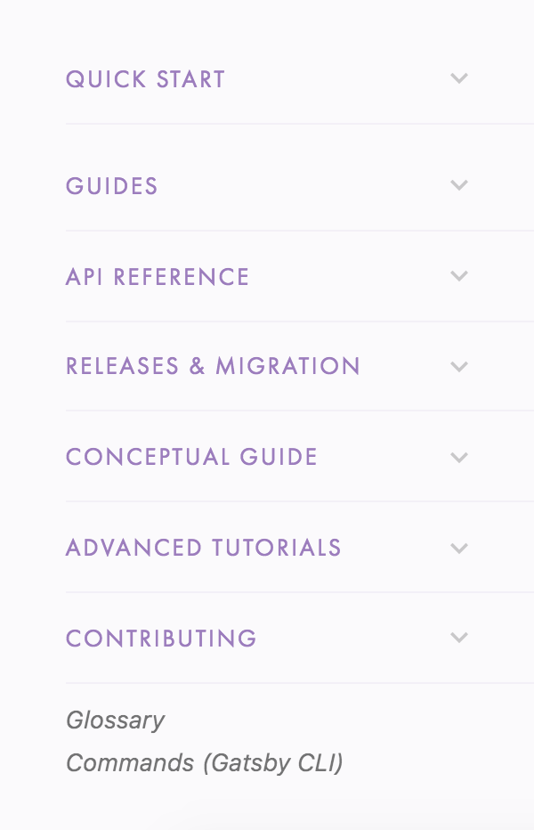
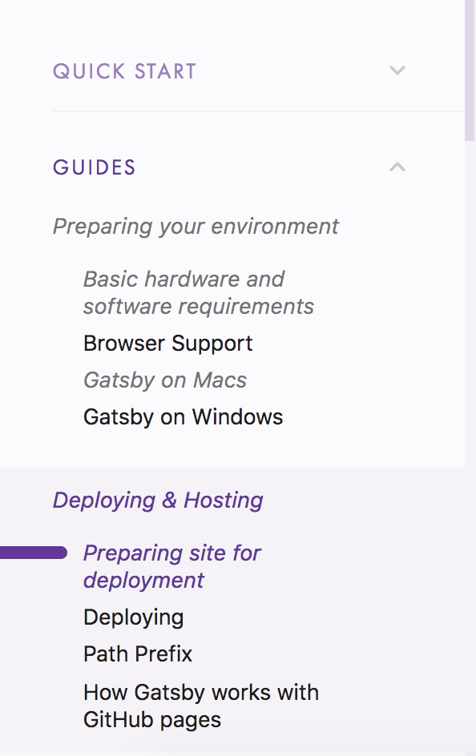
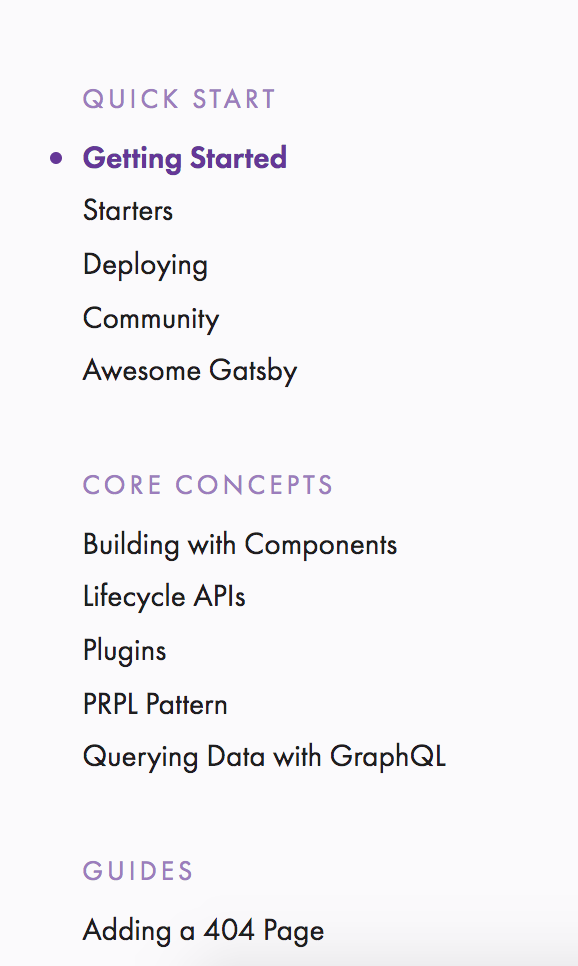

There's a new design for the [next.gatsbyjs.org/docs/](https://next.gatsbyjs.org/docs/) sidebar!

And here's the previous design (still living at www.gatsbyjs.org for now)

This all started when, one day (just kidding, it was every day), we realized that the Gatsby docs sidebar was getting too long.

Although making room for new docs was an obvious need, the solution was not obvious. It took concerted community effort to choose a new organizational structure and design to make docs easier to find.

Here's the design process.

## Provonix criteria for great docs

We wanted to make sure that the site provides necessary information to developers at each of these stages (thank you, Provonix, for the excellent articles on this, like [Eliminating API Friction Along Downstream Developer Journey](https://pronovix.com/blog/eliminating-api-friction-along-downstream-developer-journey-1) and [What is the MVP for a Developer Portal?](https://pronovix.com/blog/what-mvp-developer-portal))

1.  Discover/Research - what is this site? how can this portal help me to solve my specific task?
2.  Evaluate - can I trust this organization’s commitment to its project?
3.  Get Started - where do I begin?
4.  Develop/Troubleshoot - do I know everything to make this work? How do I get X done with Gatsby? How do I use Gatsby with [insert other tech or CMS]? Where do I go when I have a problem with Gatsby?
5.  Celebrate - will they care about my work?
6.  Maintain - how hard will it be to keep this running?

## Investigating other "excellent docs showcase" structures

Here is a list of what we liked and didn’t like in docs with similar goals to ours. We looked at NextJS, ReactJS, Expo, Ghost, Drupal, WordPress, Joomla, Silver Stripe, Netlify, and Apollo.

#### Things we liked:

- Accordion menus make design clean
- Flat menus mean nothing is hidden
- Fast action when you click buttons
- Task focused titles and headers
- Explanation of why to use the software and when not to use it
- Lots of organized "how does this work" content
- List of “lessons”
- Different organizational structures for different services

#### Things we didn’t like:

- Not enough categories
- Cluttered landing pages
- Conflicting menus on the same page
- Not enough “how to get a task done” docs
- Accordion menus make things hard to find at a glance because you can only look at one bucket at a time
- Open menus are often unorganized

As you can see, accordion menus and flat menus both have desirable pros and undesirable cons. We decided to adopt an accordion menu that will eventually be fully expandable with a toggle “open/closed” button as well as allowing you to open as many or as few buckets as you want, as opposed to one at a time. Hopefully you’ll have the best of both worlds this way!

## RFC Process

Because redesigning the information architecture of the .org site would affect the whole community and would take more than a day or two to accomplish, I wrote a [Docs redesign RFC](https://github.com/gatsbyjs/rfcs/pull/5) and got excellent feedback from many community members.

## Card sort

Many of you (36 in fact!) took the card sort to give data on how Gatsby users currently categorize existing docs. The card sort data helped inform the new structure of the docs sidebar. You can read the [card sort blogpost](https://www.gatsbyjs.org/blog/2018-06-26-card-sort-results/), which has more detail about the card sort results.

## Usability testing

One thing that happened (and this shouldn't surprise me) is that Gatsby community members are enthusiastic and willing to help. I included an invitation at the end of the card sort that invited card sort participants to sign up for a usability test, thinking "oh, no one will sign up for this." Then, about 15 people signed up, and I only need about 5-7 for solid data ([reference here](https://www.invisionapp.com/blog/ux-usability-research-testing/)).

So, I did three different usability tests with about 5 people each and got some really valuable insights. Thank you to all these people for taking the time to meet with me for usability tests!

Thank you Martyn Hoyer, Eka, Benjamin Modayil, Nicky Meuleman, Jonathan Prozzi, Kelly Lawrence, Chris Wiseman, Simon Koelewijn, Cameron Steele, Bogdan Lazar, Shannon Smith, Hugo Marques, Ria Carmin, Abhishek Vishwakarma, Peter Wiebe, and Korey Boone.

Common obstacle #1:

- We're paying attention to data from our Algolia search bar even though most people just use Google. Algolia has some problems currently: it doesn't show all results if there are too many, and it doesn't pull information from headers. That is one of the reasons it's really difficult to find things by search.

Possible solutions:

- use Google data over Algolia search data
- work on the UI for Algolia search so it pulls up what people need
- dedicated Algolia search page

Common obstacle #2:

- Information embedded in the tutorial doesn't _also_ exist in the guides, like "how to create links between pages." Algolia search doesn't find keyword inside headers within a document and Google search didn't surface this as well as guides. [TRUE???]

Solution:

- The tutorials won't have a monopoly on any information; it will also exist in the guides.
- Maybe we can tweak Algolia search to look for keywords in headers

Common obstacle #3

- People expect to find more information in Getting Started and the READme file than currently exist. They are looking to evaluate how easy Gatsby is to use through a set of basic tasks.

Solution:

- Add a recipes section to both the Getting Started and READme file with a list of how to do basic tasks very quickly

Common obstacle #4

- Ideally, people ought to be able to flow through the docs in a way that helps them build foundational knowledge and also get tasks done. Here are two examples of ideal pathways through the docs:

* Core Concepts > Guides > Tutorials
* Getting Started > Recipes > Guides > Tutorials

However, the docs themselves don't make these pathways obvious or easy to accomplish.

Solution:

- Include references, prereqs, and suggested next steps in all relevant docs

Common obstacle #5:

- API specification needed to be renamed
- People don't know a lot of docs exist. Common topics that were little known: e-commerce, wp tutorials, how to create a plugin, how to pitch Gatsby, how to sign up for the newsletter

Solution:
Perhaps do a featured docs dashboard.

Common obstacle #6
We have about 60 stub articles now that are topics people care about and we need people to write them!

Solution:
Want to volunteer to write one? Check out all the stub articles (titles in _italics_ on the left hand sidebar).

## Need 5-7 testers for new structure!

Want to sign up for a 45 minute usability test of the new structure? (It will likely take 20-30 minutes, just blocking out more time in case you have questions and more commentary!)

Sign up here: [https://calendly.com/shannon-soper/new-ia-usability-test/07-30-2018](https://calendly.com/shannon-soper/new-ia-usability-test/07-30-2018)
